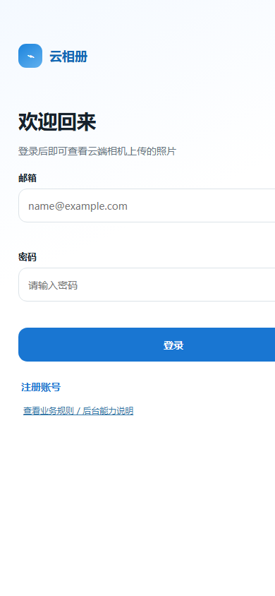
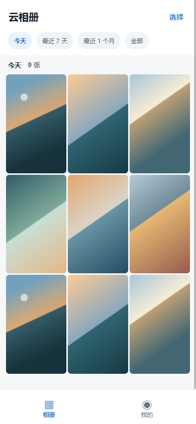
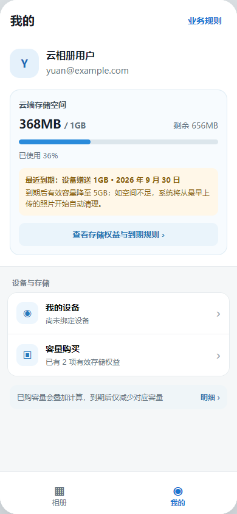
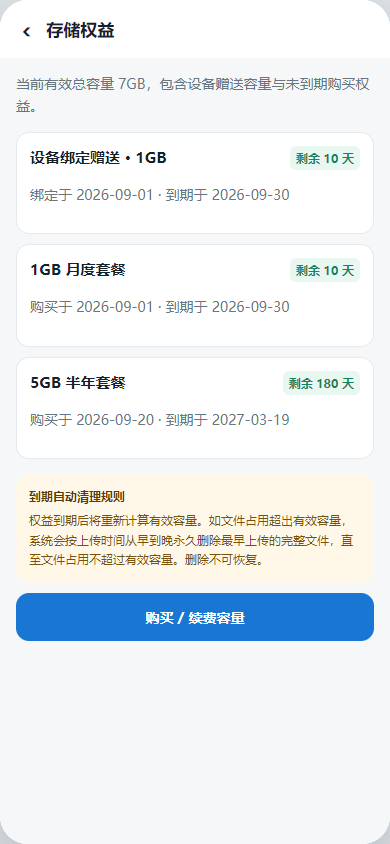

# 云相册 App 交互原型｜需求文档

- **版本**：v1
- **目标用户**：已购买可联网云端相机、希望集中查看和管理照片的个人用户。
- **交付物**：`cloud-album-prototype.html`（无需构建工具，浏览器直接打开）。

## 1. 产品目标与边界

云相册 App 将当前用户已绑定设备上传至云端的摄影文件按日期呈现，支持浏览、下载、删除、存储管理、设备绑定与容量购买。照片只允许由对应用户已永久绑定的设备上传；未绑定设备、绑定到其他用户的设备以及用户端 App 均无权直接上传照片。

本原型使用前端模拟数据演示状态与流程；不发送邮件、不支付、不上传实际文件，也不连接真实服务端。

## 2. 信息架构

```text
认证（登录 / 注册 / 忘记密码）
├─ 相册
│  ├─ 日期筛选
│  ├─ 照片详情 / 下载原图
│  └─ 多选 / 删除确认
└─ 我的
   ├─ 存储空间
   ├─ 设备绑定
   ├─ 容量购买 / 订单确认 / 模拟支付
   └─ 业务规则 / 后台能力说明
```

认证页不出现底部导航；登录后的底部导航固定为“相册、我的”。

## 3. 原型页面截图

下列图片与原型同目录交付，按功能章节就近插入，便于对照页面效果与文字说明。

### 3.1 登录



### 3.2 相册首页



### 3.3 我的与存储空间



### 3.4 存储权益与到期规则



### 3.5 后台能力


## 4. 功能需求

### 4.1 认证

| 功能 | 规则与状态 |
|---|---|
| 登录 | 邮箱格式、密码至少 6 位；提交后显示“登录中”，成功后进入相册。 |
| 注册 | 三步：邮箱 → 验证码 → 密码；注册请求必须在请求头中携带用户当前的 IANA 时区标识；演示验证码为 `123456`；验证码页显示 5 分钟倒计时与重新发送入口。 |
| 注册校验 | 邮箱格式错误、验证码错误/过期、密码长度不足、两次密码不一致都必须阻止下一步。 |
| 忘记密码 | 三步：已注册邮箱 → 验证码 → 新密码；成功后返回登录页并提示。 |
| 账号规则 | 邮箱是唯一账号标识。服务端仅在验证码验证成功后创建账号或允许重置密码。创建账号时，服务端校验注册请求头中的时区并保存到用户信息；时区无效或缺失时注册失败，不使用服务端默认时区代替。 |
| 登录状态 | 用户登录成功后，服务端签发 JWT，用户端 App 将 JWT 保存在本地，并在后续请求中通过请求头携带。App 启动时若本地存在 JWT，可直接进入登录后页面；JWT 缺失、无效或已过期时，App 必须清除本地登录状态并返回登录页。 |
| 服务端鉴权 | 除登录、注册、验证码和忘记密码等公开接口外，用户端接口统一从请求头读取并校验 JWT。服务端以 JWT 中的用户身份作为当前用户依据，不接受请求体或查询参数传入的用户 ID 作为鉴权依据。 |
| 用户时区 | App 在注册请求头中提交当前 IANA 时区标识，例如 `Asia/Shanghai`；服务端校验后将其保存到用户信息。用户登录时，服务端读取用户信息中保存的时区并写入 JWT 载荷，后续用户请求从已验证的 JWT 读取时区。设备上传相关流程不使用设备自身时区，而是根据设备绑定关系读取对应用户账号保存的时区，用于确定上传日期分组和时间展示。数据库中的业务时间统一保存为 UTC。 |

#### JWT 与请求头约定

注册请求：

```http
X-Time-Zone: Asia/Shanghai
```

登录后的用户请求：

```http
Authorization: Bearer {jwt}
```

- 注册请求头 `X-Time-Zone` 必须使用有效的 IANA 时区标识，例如 `Asia/Shanghai`；服务端将其保存到用户信息。
- JWT 载荷至少包含用户唯一标识、用户信息中保存的时区、签发时间和过期时间；服务端必须校验签名及有效期。
- JWT 只用于用户端 App 登录态和用户接口鉴权；设备申请 OSS 临时上传链接仍使用设备 ID 与设备密码进行设备身份校验。
- 服务端应统一返回未登录、JWT 无效和 JWT 已过期的鉴权错误，用户端收到后清除本地 JWT 并跳转登录页。

#### 后端统一时区规范

- 生产服务器部署在德国，但服务器所在地区和操作系统本地时区不得作为业务时间计算依据。应用、定时任务、日志关联字段及数据库连接统一使用 UTC（零时区）。
- 数据库中的日期时间统一保存为 UTC 时间；应使用能够明确表示 UTC 时间点的数据类型或约定，不保存依赖服务器本地时区解释的模糊时间。
- 用户注册时保存 IANA 时区标识，例如德国 `Europe/Berlin`、英国 `Europe/London`、美国 `America/New_York`、`America/Chicago`、`America/Denver` 或 `America/Los_Angeles`。禁止只保存固定的 UTC 偏移量，因为德国、英国和美国均可能受夏令时影响。
- 所有按用户自然日期或自然时间范围进行的查询，必须先从已验证的 JWT 载荷读取用户时区，将用户时区下的查询起止时间转换成 UTC 边界，再使用 UTC 边界查询数据库；不得直接使用服务器本地日期或服务器本地时区构造查询条件。
- 时间范围统一采用左闭右开区间 `[startUtc, endUtc)`，避免跨日边界重复或遗漏数据。例如查询用户某一天时，先计算该用户时区当天 `00:00:00` 和次日 `00:00:00` 对应的 UTC 时间，再查询 `created_at >= startUtc AND created_at < endUtc`。
- “今天”“最近 7 天”“最近 1 个月”、按日期分组、权益生效与到期、到期自动清理和通知调度，均以用户账号保存的 IANA 时区计算自然日边界，再转换为 UTC 执行数据库查询或任务判断。
- UTC 与用户时区之间的转换必须使用标准时区库及 IANA 时区规则，由时区库自动处理夏令时切换；不得在代码中写死 `UTC+1`、`UTC+2`、`UTC-5` 等偏移量。
- 接口返回具体时间点时使用带 UTC 标识的 ISO 8601 格式，例如 `2026-09-05T12:30:00Z`；App 根据用户时区负责最终显示。若接口返回仅用于界面展示的日期分组标签，服务端可按 JWT 中的用户时区计算后返回。
- 设备接口没有用户 JWT。设备通过设备 ID 和密码鉴权并确认绑定关系后，服务端从绑定用户信息读取时区，按同样规则计算上传日期分组及相关时间边界。

### 4.2 多语言与本地化

App 支持以下三种界面语言：

| 语言 | 语言代码 | 界面名称 |
|---|---|---|
| 简体中文 | `zh-CN` | 简体中文 |
| 英语 | `en` | English |
| 德语 | `de` | Deutsch |

#### 语言选择与持久化

- 用户可在“我的 → 语言设置”中切换界面语言，切换后当前页面及后续页面立即使用新语言，不要求退出登录或重启 App。
- App 首次启动时读取操作系统首选语言：属于中文、英语或德语时选择对应语言；其他语言默认使用英语。
- 用户主动选择的语言优先于系统语言，并保存在 App 本地；退出登录后仍保留该语言偏好，重新安装或清除 App 数据后重新按系统语言初始化。
- 登录状态、设备绑定、照片数据和存储权益不因语言切换而改变。

#### 文案与格式规则

- 登录、注册、相册、我的、设备绑定、容量购买、订单确认、支付结果、存储权益、删除确认、错误提示和帮助规则等所有用户可见文案，都必须提供中文、英文和德语版本，不得在英文或德语界面中混入未翻译的中文业务文案。
- App 使用本地资源键管理界面文案，不在页面逻辑中直接写死显示文本。缺少目标语言翻译时回退到英语，并记录缺失的资源键。
- 后端返回稳定的业务状态码和错误码，App 根据错误码在本地映射对应语言文案；后端不应只返回固定中文错误消息作为界面最终文案。
- 用户生成的内容、文件名、设备型号、邮箱、设备 ID 和订单号保持原值，不进行自动翻译。
- 日期、时间、数字和金额按当前界面语言及地区习惯格式化，但时间计算和日期查询仍以用户账号保存的 IANA 时区为准。语言只影响展示格式，不改变用户时区或数据库 UTC 时间。
- 当前套餐币种固定为人民币 `CNY`，三种语言界面均需明确展示币种；不得因语言切换自动换算为欧元、英镑或美元。
- 中文、英文和德语文案长度差异较大，页面布局必须支持文字换行和按钮自适应；关键操作按钮不得因德语文案较长而被裁切或遮挡。

#### 后端及通知规则

- 用户端请求可在请求头携带当前界面语言，例如 `Accept-Language: zh-CN`、`Accept-Language: en` 或 `Accept-Language: de`，供后端选择通知模板或必要的本地化内容。
- 服务端应校验并规范化语言代码；未传递或不支持时使用英语。该语言请求头不参与身份鉴权，也不代替 JWT 中的用户时区。
- 邮件验证码、权益到期提醒、自动清理通知和支付结果通知需要提供中文、英文和德语模板。发送通知时优先使用用户最近一次同步到服务端的语言偏好；没有服务端语言偏好时使用英语。
- 用户切换语言后，App 应将语言偏好同步到用户信息，供后续服务端通知使用；同步失败不影响 App 本地语言切换，但应在后续请求中重试。

### 4.3 相册

- 顶部显示“云相册”和“选择”。
- 筛选项：今天、最近 7 天、最近 1 个月、全部。
- 按上传日期分组，每组采用响应式三列缩略图网格；缩略图宽高随可用屏幕空间自适应。在 `390 × 844` 视口中，首屏最多展示 9 张，并以 3 列 × 3 行尽量铺满相册可用区域。
- 原型提供 27 张完全本地生成的模拟缩略图，不依赖外部图片服务；日期覆盖今天、最近 7 天、最近 1 个月及更早时间。“今天”“最近 7 天”“最近 1 个月”“全部”四个筛选均有数据。
- 筛选结果超过 9 张时，相册内容区域支持上下滚动浏览；滚动到底显示“没有更多内容”。真实产品应以分页游标请求下一页。
- 用户注册成功并登录 App 后，若账号尚未绑定设备，相册主页固定展示空状态，不展示模拟照片或历史照片；空状态需明确说明“绑定设备后，设备上传的照片会显示在这里”，并提供前往“我的 → 我的设备”的操作入口。
- 点击缩略图进入沉浸式详情，显示：名称、文件大小、上传时间、拍摄设备；支持上一张、下一张、下载原图（模拟下载反馈）。
- 点击“选择”进入多选模式：展示选中数量、全选/取消全选、取消选择、删除；删除前必须二次确认且明确不可恢复；删除操作直接永久删除原图、缩略图、预览图及关联元数据，不设置回收站；删除后更新相册和已用容量。

### 4.4 存储与设备

| 领域 | 需求 |
|---|---|
| 存储概览 | 显示邮箱、已用/总容量、剩余容量、进度条；剩余不足时显示提醒。默认展示 368MB / 1GB。 |
| 默认容量 | 设备绑定成功后，系统赠送 1GB / 1个月云存储权益；有效期自绑定成功时刻起计算 1 个自然月。所有权益到期后有效容量可以降至 0GB；若文件占用超过 0GB，系统按到期自动清理规则永久删除文件。 |
| 设备绑定 | 输入设备 ID 与初始绑定密码并提交校验；成功后显示型号、部分脱敏 ID 与绑定时间。设备绑定后与当前账号永久强绑定，不支持解绑、换绑或再次绑定其他账号。演示合法格式为 `CC-YYYY-XXXX-XXXX`，演示密码为 `CAMERA123`。 |
| 错误状态 | 设备 ID 格式错误、设备不存在、初始密码错误、已被其他账号绑定、当前账号已有其他设备。原型覆盖前四项；“已绑定设备”状态表示当前账号不可再绑定。 |
| 未绑定设备提示 | 用户登录后若账号尚未绑定设备，“我的”页面需展示醒目的绑定提示，说明绑定设备后才能接收和查看设备上传的照片，并提供“立即绑定设备”入口；绑定成功后隐藏该提示，并展示设备信息和赠送的存储权益。 |

### 4.5 容量购买、存储权益与到期自动清理

#### 套餐与购买

- 套餐：1GB / 1 个月 / ¥100，5GB / 6 个月 / ¥300，20GB / 12 个月 / ¥1,999。
- 用户选中套餐后进入订单确认弹窗，明确容量、有效期和金额。
- App 支付渠道暂定使用乒乓支付平台收款；原型阶段仍仅模拟支付成功，不发起真实支付。
- 正式支付时，App 向后台创建订单；后台根据订单套餐快照、金额和币种生成乒乓支付所需的支付参数或支付链接，App 仅负责调起或跳转支付，不直接持有商户密钥。
- 乒乓支付完成后，后台必须以支付平台的异步回调作为支付成功的唯一依据：校验回调签名、商户订单号、支付金额、币种和订单状态；不得以 App 前端回跳或客户端“支付成功”结果直接开通容量。
- 回调处理必须幂等。同一支付通知重复到达时，只能将订单从待支付成功转换一次，并仅创建一笔对应的存储权益；校验失败、金额不一致或订单状态不匹配时记录审计日志，不开通权益。
- 支付成功后，后台依据订单快照创建独立权益并实时增加有效总容量；“我的”页面显示当前套餐、到期时间和续费入口。
- 支付订单、乒乓支付交易号、回调原文、验签结果、处理时间与失败原因需记录，支持对账和问题追溯。

#### 多次购买：容量权益叠加

每次购买创建一笔独立的存储权益，记录容量、购买时间、到期时间和状态；新套餐**不覆盖**未到期的旧套餐。

当前有效总容量 = 所有未过期的设备绑定赠送权益 + 所有未过期购买权益的容量之和。每项权益从生效时刻起按自然月或自然年计算有效期，到期时刻为对应月份或年份的同一日期、同一时刻；没有对应日期时取该月最后一天的同一时刻。设备绑定赠送的 1GB 从绑定成功时刻起计算 1 个自然月。权益到期后只减少该项权益提供的容量，不影响其他未到期权益。

示例：用户拥有设备赠送 1GB，9 月 1 日购买 1GB / 1 个月，9 月 20 日再购买 5GB / 6 个月：

| 时间 | 有效权益 | 当前有效总容量 |
|---|---|---:|
| 9 月 1 日 | 赠送 1GB（至 10 月 1 日）+ 1GB（月度） | 2GB |
| 9 月 20 日 | 赠送 1GB + 1GB（月度）+ 5GB（半年） | 7GB |
| 10 月 1 日 | 赠送 1GB、月度 1GB 到期，半年 5GB 仍有效 | 5GB |
| 次年 3 月 20 日 | 半年 5GB 到期 | 0GB |

“我的”页需要展示最近到期权益、当前有效容量、权益明细入口，并在购买确认页明确说明“本套餐会与现有有效存储空间叠加，到期后仅减少对应容量”。

#### 到期自动清理策略

1. 权益到期时，先重新计算有效总容量。
2. 若用户文件占用小于或等于有效总容量，不删除任何文件。
3. 若用户文件占用大于有效总容量，系统按**上传时间从早到晚**永久删除最早上传的完整文件，直至剩余文件占用小于或等于有效总容量。
4. 以上传时间为准，不以拍摄时间为准；每次删除完整原图、缩略图与关联元数据。
5. 不保留独立的删除审计记录；删除时仅在照片原图、缩略图和预览图文件记录中写入删除原因，取值为用户主动删除或权益到期自动清理。
6. 到期前、开始清理、清理完成均需通知用户；通知明确“删除不可恢复”。
7. App 相册、已用容量、存储进度在清理后实时更新。

到期风险提醒示例：`1GB 月度权益将于 10 月 1 日到期。到期后有效容量将降至 6GB；如空间不足，系统会从最早上传的照片开始自动清理。`

## 5. 后台能力说明

### 5.1 设备数据维护

本期不开发设备数据导入页面、CSV / Excel 导入功能或独立后台管理平台。设备数据由维护人员通过数据库脚本直接插入设备表。

建议设备基础字段：

```text
device_id, initial_password, model
CC-2026-AB12-8A2F, CAMERA123, CloudCam C1
```

- 数据库必须对 `device_id` 建立唯一约束，防止重复设备 ID。
- 插入前需校验设备 ID、初始密码和型号等必填字段；初始密码不得以明文保存，应保存安全哈希值。
- 数据插入应通过经过审核的 SQL 脚本执行，避免手工逐条修改；脚本需支持事务，任一记录失败时整体回滚或输出明确的失败记录。
- 数据库账号应遵循最小权限原则；设备数据维护脚本由发布与运维流程管理，本期不建设数据库脚本执行日志表。

### 5.2 设备上传 API

```http
POST /api/v1/device/uploads
Authorization: Device {device_id}:{password}
Content-Type: application/json

{
  "device_id": "CC-2026-AB12-8A2F",
  "device_password": "CAMERA123",
  "file_name": "image.jpg",
  "content_type": "image/jpeg",
  "file_size": 5242880
}
```

照片上传能力仅向设备端开放，不向用户端 App 开放。用户 JWT 只能用于浏览、下载、删除和管理当前用户照片，不能申请 OSS 上传链接，也不能直接或间接提交照片文件。

设备上传前必须先向服务端请求一次性、短时有效的临时上传链接。服务端必须同时校验设备 ID、设备密码及永久绑定关系，并确认该设备正是目标用户所绑定的设备；未绑定设备或绑定到其他用户的设备均不得获得上传链接。校验通过后，由后台生成阿里云 OSS 临时上传链接并返回给该绑定设备。设备使用该链接直接将原图上传至 OSS，不经过应用服务器传输文件内容。上传接口不判断文件是否已存在，重复上传也按新的文件记录处理。

服务端不得提供用户 App 上传照片的接口，也不得接受用户 JWT 作为设备上传鉴权凭据。OSS 临时上传链接必须绑定本次设备上传会话、服务端生成的对象路径、允许的文件类型、文件大小上限和短有效期，不得被其他设备复用或用于上传到任意对象路径。

服务端处理顺序：

1. 校验设备 ID 与设备密码。
2. 校验设备是否存在唯一且永久的用户绑定关系；未绑定设备不能上传，绑定到其他用户的设备不能替目标用户上传。绑定关系校验成功后，只能从该绑定关系取得用户 ID，并读取该用户账号保存的时区；不得接受设备请求体或 App 参数传入用户 ID 作为照片归属依据。
3. 校验文件类型，仅接受 JPG、JPEG、PNG、HEIC。
4. 校验单文件大小上限。
5. 校验用户剩余云存储是否足够。
6. 创建仅属于该绑定设备的上传会话，记录设备、永久绑定关系、绑定用户、鉴权时间和容量预留信息，再生成限定对象路径、有效期和权限范围的 OSS 临时上传链接。
7. 原申请设备使用临时链接将原图直传 OSS；其他设备和用户端 App 不得复用该链接。
8. 接收并校验 OSS 上传成功回调，异步生成缩略图和预览图。
9. 只有缩略图、预览图均成功上传 OSS，且 OSS 回调对应的文件存储路径成功写入数据库后，才创建可访问的照片记录并更新用户已用容量。
10. App 仅展示已完成照片记录中的文件；照片的上传日期分组及面向用户的时间展示，使用设备所绑定用户账号保存的时区计算。

| 失败码建议 | 场景 |
|---|---|
| `DEVICE_AUTH_FAILED` | ID 或密码无效。 |
| `DEVICE_NOT_BOUND` | 设备未绑定任何用户。 |
| `DEVICE_BINDING_MISMATCH` | 设备绑定关系与目标照片归属用户不一致。 |
| `UPLOAD_SOURCE_FORBIDDEN` | 用户端 App 或其他非绑定设备来源尝试上传。 |
| `UNSUPPORTED_FILE_TYPE` | 非允许图片格式。 |
| `FILE_TOO_LARGE` | 超过单文件限制。 |
| `STORAGE_INSUFFICIENT` | 用户剩余云存储不足。 |

### 5.3 图片存储与多尺寸派生图

设备上传采用“**仅绑定设备上传 + 原图保留 + 两个派生版本**”策略。只有用户永久绑定的设备可以申请 OSS 临时上传链接并直传原图；用户端 App 仅消费后台已发布的照片数据，不提供照片上传能力。原图上传成功后，后台服务器从 OSS 下载原图，在本地生成缩略图和预览图，再将两个派生文件上传回 OSS。每页相册最多展示 9 张、三列布局，使用单一缩略图即可满足列表清晰度与加载速度，不生成微缩略图。

| 文件版本 | 用途 | 处理方式 | 是否可下载 |
|---|---|---|---|
| 原图 Original | 用户下载、长期留存 | 保持原始分辨率；仅进行安全校验及必要的 EXIF 处理。 | 是 |
| 缩略图 | 相册列表、选择模式 | 长边限制约 480px；JPEG/WebP 质量约 65–75。 | 否 |
| 预览图 | 照片详情、全屏浏览 | 长边限制约 1920px；JPEG/WebP 质量约 80–85。 | 否 |

HEIC、PNG 等原始格式可保留；派生图建议统一输出 WebP，必要时提供 JPEG 兼容兜底。

#### App 使用策略

1. **相册列表**：只加载缩略图；首屏和下滑加载使用缩略图，图片未返回时显示占位或加载骨架。
2. **照片详情**：点击时先沿用列表缩略图避免白屏，随后加载预览图并无感替换；可预加载上一张和下一张的预览图。
3. **下载原图**：App 请求下载接口，后台鉴权后签发短时有效下载链接，不直接暴露对象存储地址；需展示下载中、成功、失败重试与原图不可用反馈。

#### 后台处理流程

```text
用户已绑定设备请求临时上传链接（用户端 App 无上传入口）
  ↓
校验设备身份及其唯一永久绑定关系，并读取绑定用户、格式、大小和剩余空间
  ↓
后台生成 OSS 临时上传链接
  ↓
原申请绑定设备直传原图至 OSS，并接收 OSS 上传成功回调
  ↓
后台从 OSS 下载原图，在本地生成缩略图（480px）和预览图（1920px）
  ↓
上传缩略图和预览图至 OSS
  ↓
OSS 回调确认派生文件上传成功，数据库保存原图、缩略图和预览图路径
  ↓
写入可访问的照片记录并更新用户文件占用
  ↓
App 刷新相册
```

#### 存储配额、删除与异常

- 用户用量按**原图大小**计费；缩略图和预览图为平台体验生成的技术文件。
- 用户删除照片或触发到期自动清理时，原图、缩略图、预览图必须作为一个文件组一并删除；删除后同步更新已用容量、相册列表并清除 CDN 缓存。
- 自动清理仍按**上传时间从早到晚**处理文件组。
- 每条上传会话和照片记录必须保存设备 ID、永久绑定关系 ID 与由绑定关系确定的用户 ID。照片归属不能由 App、设备请求参数或上传回调自由指定。
- 原图哈希、尺寸、MIME 类型、上传时间应写入元数据，用于去重、审计与故障排查。
- 原图上传成功后，后台从 OSS 下载原图并在本地生成缩略图与预览图，再将派生文件上传回 OSS；只有三个版本均已成功上传且对应 OSS 回调已将路径写入数据库，才向 App 展示照片。
- 任一派生图生成或上传失败时，不创建可访问的照片记录；后台记录失败原因并删除本次生成的文件，支持重试。未完成处理的原图不计入用户可用照片，也不应出现在相册中。
- 原图异常时返回“原图暂不可下载”，不得将 Preview 误作为原图返回；派生图生成、删除与清理流程均需在对应文件记录中维护状态、失败原因并支持重试。

### 5.4 数据库配置方案

本期不开发独立后台管理平台，也不使用 Swagger 作为配置入口。平台配置和存储套餐由维护人员通过数据库脚本直接维护，业务服务从数据库读取当前生效配置。

#### `platform_config` 平台配置表

`platform_config` 用于保存全局上传限制和设备绑定赠送权益配置：

| 配置项 | 说明 |
|---|---|
| 单文件大小上限 | 保存设备单次上传文件的最大允许字节数；生成 OSS 临时上传链接前校验，OSS 回调时根据实际文件大小再次校验。 |
| 允许的文件类型 | 保存允许上传的扩展名、MIME 类型等规则，至少支持 JPG、JPEG、PNG、HEIC。 |
| 设备赠送容量 | 保存设备绑定成功后赠送的容量字节数；绑定时固化到独立权益记录。 |
| 设备赠送有效期 | 保存赠送权益的有效期数值和单位，例如 `1 MONTH`；绑定时按用户时区计算并固化 UTC 到期时间。 |
| 配置版本及状态 | 保存版本、生效状态、创建时间和更新时间，用于确定当前生效配置。 |

平台配置变更只影响后续上传或后续设备绑定，不追溯修改已上传文件和已产生的权益。

#### `storage_plan` 套餐表

`storage_plan` 用于保存 App 展示和订单结算使用的存储权益套餐：

| 字段内容 | 说明 |
|---|---|
| 套餐名称 | 例如“1GB 月度套餐”“5GB 半年套餐”。 |
| 增加容量 | 单次购买增加的容量字节数。 |
| 有效期 | 有效期数值和单位，例如 `1 MONTH`、`6 MONTH`、`12 MONTH`。 |
| 销售金额 | 购买存储权益的价格，使用人民币分保存，禁止使用浮点数。 |
| 币种 | 当前固定为人民币 `CNY`。 |
| 排序与推荐标识 | 控制 App 套餐列表顺序和“推荐”标签。 |
| 状态 | 至少区分生效、下架和归档；App 只展示当前生效套餐。 |
| 版本和时间 | 保存套餐版本、创建时间和更新时间。 |

配置与订单规则：

1. `platform_config` 和 `storage_plan` 的变更通过经过审核的数据库脚本执行；脚本版本和操作记录由发布与运维流程管理，本期不落库。
2. 删除已产生订单的套餐时不得物理删除，应将 `storage_plan` 状态改为归档。
3. 用户进入购买页时读取当前生效套餐；创建订单时将套餐名称、容量、有效期、金额、币种和套餐版本写入订单快照。
4. 已创建但未支付的订单继续按创建时快照结算；后续改价只影响新订单。
5. 支付成功后依据订单快照创建独立存储权益；后续修改或归档套餐不影响已生效权益。
6. 服务启动时和配置缓存刷新时需校验配置完整性；没有有效平台配置或套餐数据异常时，应拒绝对应业务操作并记录错误，不使用不明确的代码默认值代替。

## 6. 原型演示路径

1. **登录**：输入合法邮箱与至少 6 位密码，进入相册；非法输入会显示校验错误。
2. **注册**：注册账号 → 合法邮箱 → 输入 `123456` → 输入两次相同且至少 6 位的密码。
3. **相册管理**：点击缩略图查看详情；相册页选择 → 勾选照片 → 删除 → 确认。
4. **设备绑定**：我的 → 我的设备 → 输入 `CC-2026-AB12-8A2F`、`CAMERA123` → 提交。
5. **购买容量**：我的 → 容量购买 → 选套餐 → 继续 → 模拟支付。
6. **后台能力**：本期不提供独立后台管理页面；平台配置、套餐和设备数据通过数据库脚本维护。

## 8. 后续落地建议

1. 接入身份服务、邮件服务和验证码过期/频控策略。
2. 定义对象存储、图片缩略图/原图分层、下载签名 URL 与异步删除策略。
3. 设计设备密钥维护
4. 为容量购买接入乒乓支付、订单、支付回调验签、对账、过期续费和幂等账本。
5. 建立 API 限流、病毒扫描、图片元数据处理及存储配额事务校验。
